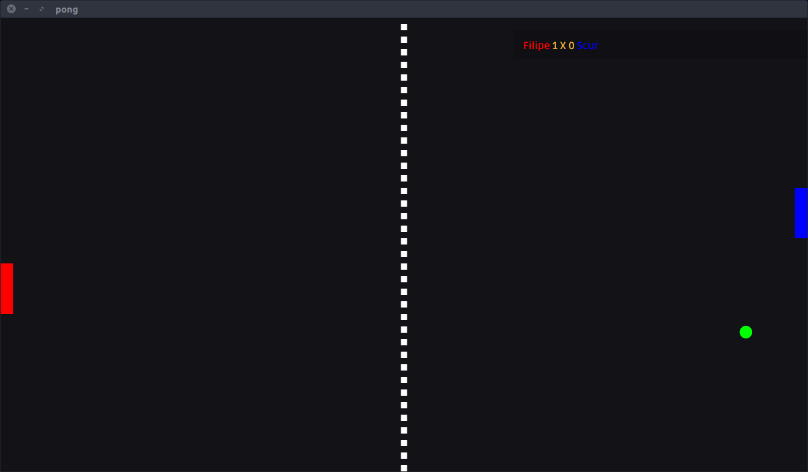

# distributed_pong 

Pong game made for Distributed Systems and Parallel Programming class at [Universidade de Caxias do Sul](www.ucs.br)



## How-to

* Up/Down moves the player

## About

* Basic two-player UDP client/server networking
* Basic OpenGL *[ShaderToy Style](http://shadertoy.com)* ~~Quad~~ Rendering
* C99 conformant
* [Handmade Hero](https://handmadehero.org) inspired
* Only Linux platform was implemented

## Featuring

* Windowing powered by [GLFW](https://github.com/glfw)
* [Dear ImGUI](https://github.com/ocornut/imgui) by [Omar](https://github.com/ocornut)
* [cimgui](https://github.com/Extrawurst/cimgui) by [Stephan Dilly](https://github.com/Extrawurst)
* ImGUI [style](https://www.unknowncheats.me/forum/direct3d/189635-imgui-style-settings.html) by Extasy Hosting
* [Ruda Font](https://fonts.google.com/specimen/Ruda) by marie monsalve and Angelina S‡anchez

## Installing

```
sudo apt-get install -y gcc
sudo apt-get install -y libglfw3
sudo apt-get install -y libglfw3-dev
sudo apt-get install -y pkg-config
sudo apt-get install -y git
git clone https://github.com/fscur/distributed_pong.git
cd distributed_pong
./build_server.sh
./build_client.sh
```

## Known Issues

* Closing while awaiting a challenger does not notify server of disconnection, and server has to from a use o be restarted.